# YouTube Data API(v3)入門

---

## YouTube Data APIを使う前に

- Googleアカウントが必要
- アプリケーションの登録が必要
- 上記を行ってAPIキーを取得することが必要

+++

## Googleアカウントの作成

省略！

+++

## アプリケーションの登録

- Google Developers Console
  - https://console.developers.google.com/?hl=ja
- まずプロジェクトを作成する
  
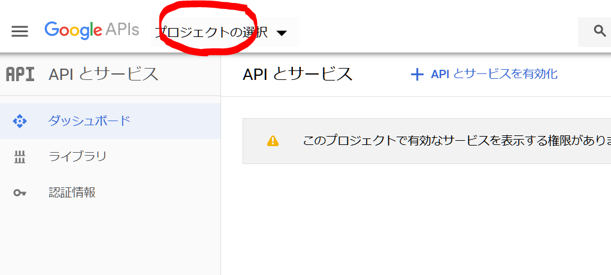

+++

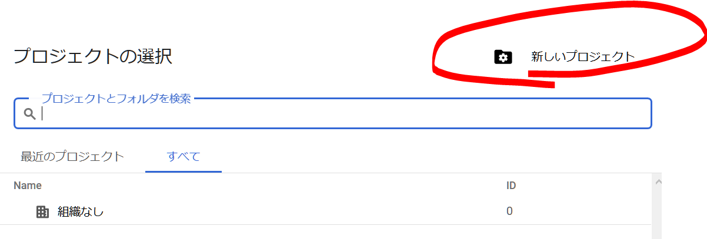

+++

- プロジェクト名はてきとう

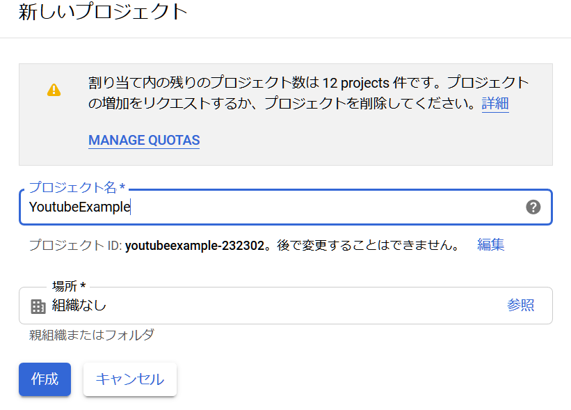

+++

- プロジェクトを選択

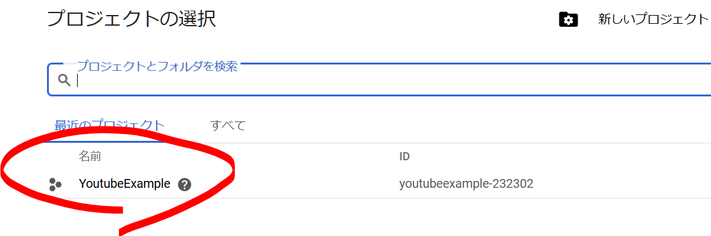

+++

- APIを追加していく

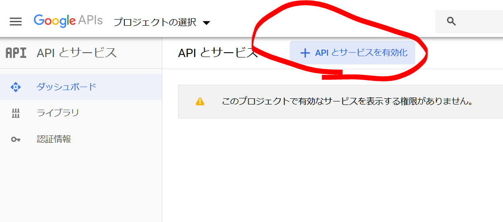

+++

- YoutTube Data API v3を選ぶ

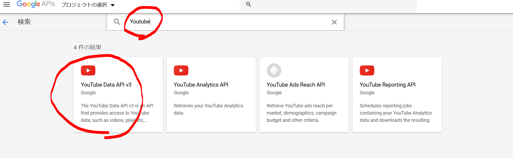

+++

- APIを有効にする

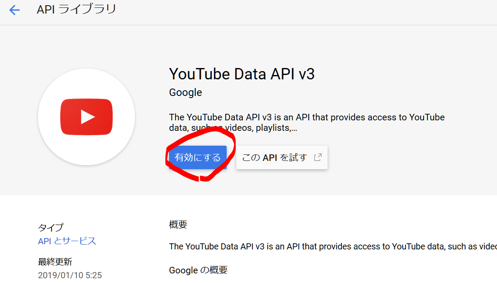

+++

- APIキーを登録する
  - 認証情報を追加する

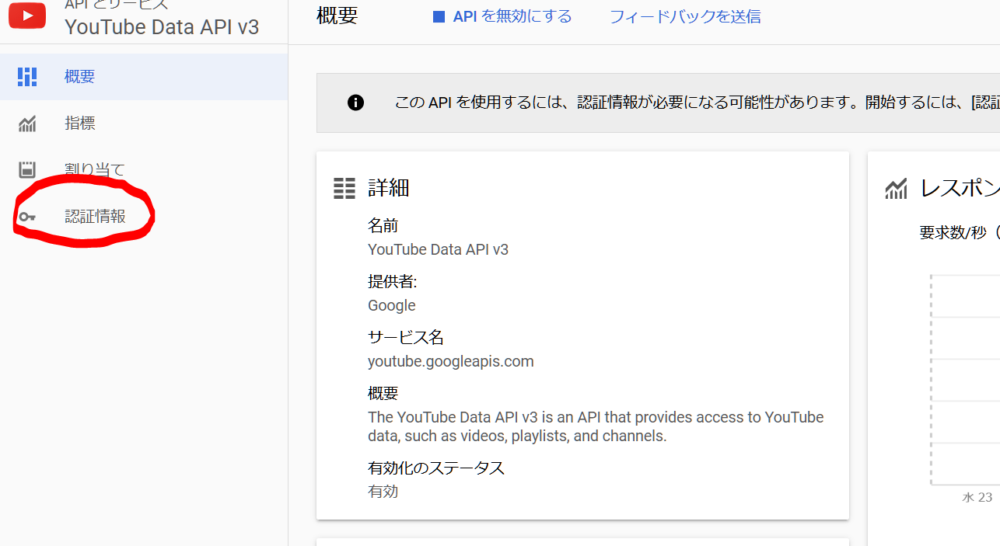

+++

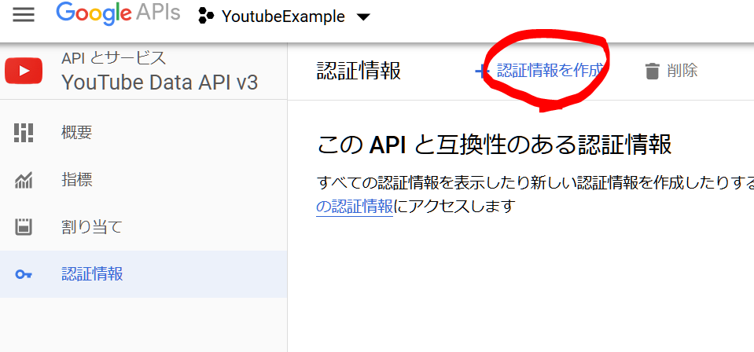

+++

- 使用するAPI -> YouTube Data API v3
- APIを呼び出す場所 -> その他UI
- アクセスするデータの種類 -> 一般公開データ

+++

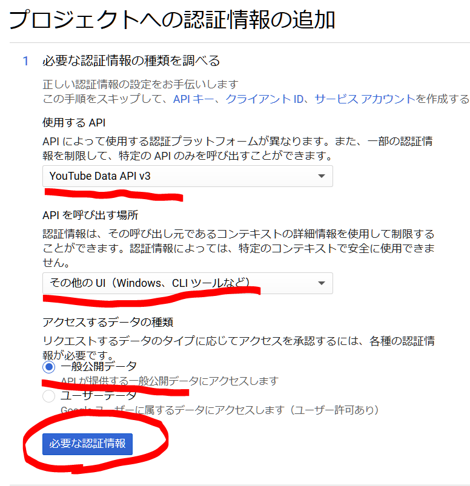

+++

- ここのAPIキーをコピペする。

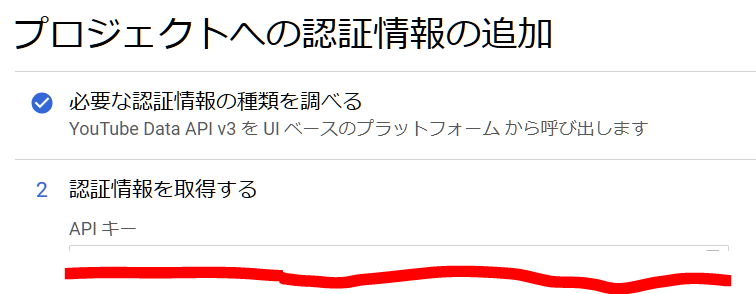

+++

- 事前準備は以上で終了。

---

## 基本的な流れ

1. APIキーを呼び出す
1. APIキーを使ってHTTPリクエストを投げる
1. 情報を受け取る
1. パースする

---

## APIキーを呼び出す

```python
KEY_FILENAME = "Key"


def main():
    with open(file=KEY_FILENAME, mode='r', encoding='utf-8') as f:
        API_KEY = f.readline()
    print(API_KEY)
    print("↑APIキー")


if __name__ == '__main__':
    main()
```

